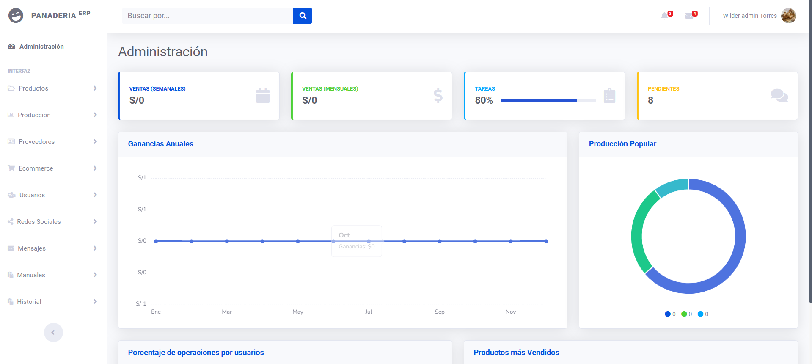

# Los Gemelos

El presente proyecto tiene como objetivo **automatizar** y mejorar la gestión de la **producción** e **inventarios** en la panificadora **"Los Gemelos"**, brindando una solución integral para la administración del establecimiento. A través de esta plataforma virtual, los gerentes y empleados podrán gestionar de manera eficiente todas las actividades relacionadas con la operación diaria de la panificadora.

Este sistema digital sustituye la gestión tradicional en papel y proporciona un entorno más ágil y controlado. Las funcionalidades clave del sistema incluyen la capacidad de **visualizar, ocultar, modificar y eliminar** registros en tiempo real, lo que optimiza la administración y reduce posibles errores humanos.

Es importante señalar que este proyecto es una **mejora significativa** sobre un proyecto llamado**"Freskypan"**, incorporando nuevas características y un diseño más intuitivo, con el objetivo de aumentar la eficiencia operativa, mejorar la precisión de los inventarios y agilizar los procesos de producción.

Con este avance, **Los Gemelos** no solo busca modernizar sus operaciones, sino también potenciar la productividad, optimizar los recursos y mejorar la experiencia tanto para empleados como para clientes.

## Capturas

## Objetivos

### General

- Desarrollar un software de inventario y producción para panadería
  buscando mejorar la gestión eficiente de sus procesos.

### Específicos

- Implementar un sistema que permita el control estructurado del
  inventario y el área de producción para proporcionar un manejo
  administrativo dentro dicha entidad.
- Analizar los requerimientos que se necesitan para el desarrollo de el Sistema.
- Implementar en el software que permita la iteración rápida y dinámica
  con el usuario final y el servidor.

## Herramientas Utilizadas

- Bootstrap 4.
- CSS3.
- HTML5.
- JavaScript.
- PHP.
- SQL.

## Roles de Desarrollo

| Rol                  | Asignado                                              |
| -------------------- | ----------------------------------------------------- |
| Programador Backend  | [Wilder Torres](https://github.com/wilderTorres18)    |
| Programador Frontend | [Jhomar Chero Sosa](https://github.com/Jhomar-Alexis) |

## Documentación

| Archivo              | Enlace                                                                                            |
| -------------------- | ------------------------------------------------------------------------------------------------- |
| Bocetos              | [Descargar](https://drive.google.com/drive/folders/1-9OAr7iJVqql0uvNTpbnihSJ-nz-91gB?usp=sharing) |
| Diapositivas         | [Descargar](https://drive.google.com/drive/folders/1UcpOuH4Ig02_zBZ58njj2i7Y7ZdBx4yZ?usp=sharing) |
| Evaluación           | [Descargar](https://drive.google.com/drive/folders/1MaN727ayfZcXXdlHrd4I_LggYYD6ewMe?usp=sharing) |
| Historias de Usuario | [Descargar](https://drive.google.com/drive/folders/1hYHAMaa1GCWaSr0Ytax4328zEi3MyxdF?usp=sharing) |
| ISO 25040            | [Descargar](https://drive.google.com/drive/folders/1cNY4as9KmAOfAp0HZJa7Yv08AFAYHv7c?usp=sharing) |
| Marco Teórico        | [Descargar](https://drive.google.com/drive/folders/1ykSK8njpL9b60qncs6gUnVeyCcHS8Dt-?usp=sharing) |
| Norma 830            | [Descargar](https://drive.google.com/drive/folders/1UbmYFZYbN1mwKJ74XNt3h6MD1XdpoUQ8?usp=sharing) |
| SQL                  | [Descargar](https://drive.google.com/drive/folders/1eqf0Vdiv5qRVm69MFLSyV1kNHUGOiBG9?usp=sharing) |

## Instalación

Mueva la carpeta descargada a su servidor, recuerde importar la base de datos que está dentro de la carpeta SQL.

## Contribuciones

Las solicitudes de extracción son bienvenidas. Para cambios importantes, abra primero un problema para discutir qué le gustaría cambiar.

Asegúrese de actualizar las pruebas según corresponda.
